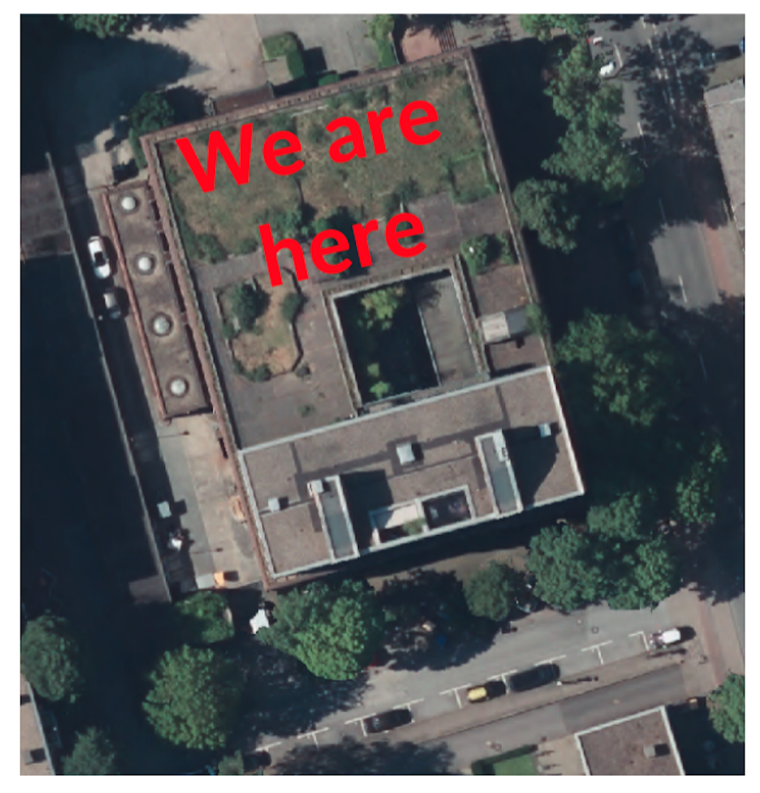
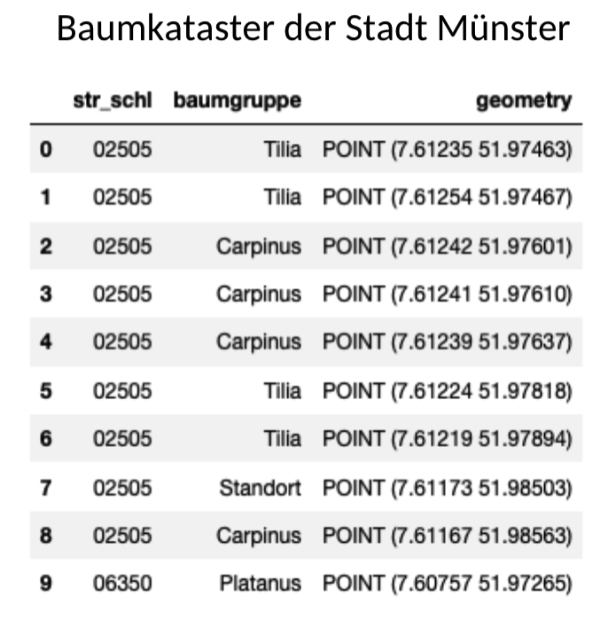
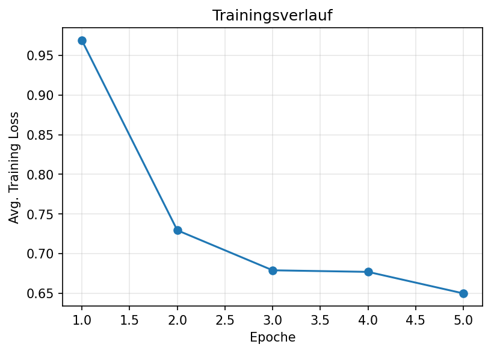
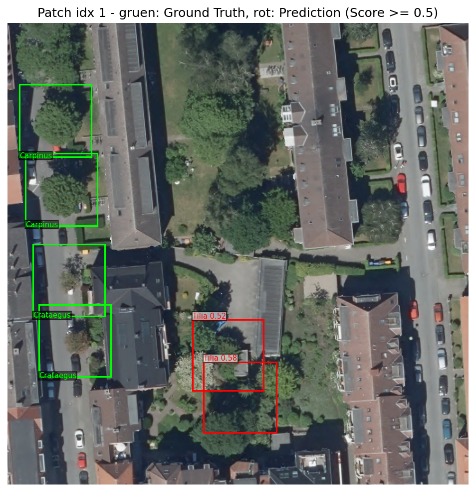

## Project Overview

::::: columns
::: {.column width="45%"}
**Higher Order Goal/ Tech4Good:** Tree pollen can be a source of hay fever for many people - be able to avoid locations with certain species!
:::

::: {.column width="35%"}
**Technical Goal:** Automatically detect and classify tree species from aerial pictures of your city.
:::
:::::

::: fragment

------------------------------------------------------------------------
:::

::: fragment
#### OUTLOOK

- **Target Area:** Münster city centre (aerial orthophotos).
- **Resolution:** High-resolution imagery (10 cm ground resolution).
- **Model:** Faster R-CNN (ResNet-50 FPN backbone).
- **Evaluation:** Loss Curve, Standard COCO metrics (mAP), Exemplatory Inspection

🔗 [GitHub Repo](https://github.com/SarahRinke/techlabs_trees_26/)

:::

------------------------------------------------------------------------

## Data Sources {.smaller}

:::::::: columns
:::::: {.column width="60%"}
### Orthophotos (Open Geodata NRW)

- DOP10 RGBI tiles (\*.jp2)
- 10 cm resolution
- geo reference: EPSG:25832
- Tiles `404_5757`, etc. (here: 4) from summer 2020
- (https://www.opengeodata.nrw.de/produkte/geobasis/lusat/)

<!-- Inner Column Container (uses 4 colons) -->

::::: columns
::: {.column width="50%"}
{fig-alt="tim_online_aerialphoto_selection_muenster" width="90%"}
:::

::: {.column width="50%"}
{width="90%"}
:::
:::::
::::::

::: {.column .fragment width="40%"}
### Tree Cadastre

- `geojson` /  `gpkg`
- https://opendata.stadt-muenster.de/dataset/digitales-baumkataster-m%C3%BCnster

{width="80%"}
:::
::::::::

::: fragment
### Integrate Sources

- Tree Cadastre: label data; BUT: point coordinates ➡ transform into shape coordinates (bounding boxes)
:::

# ⚙️ PROCESS {data-background-color="#1c2d37"}

## Analysis Pipeline

::: smaller
:::

### DATA PREPARATION

1.  **Data loading** – Load `.jp2` tiles & GeoJSON tree cadastre.
2.  **CRS unification** – Reproject tree coordinates to raster CRS.
3.  **Geo-to-pixel** – Map coordinates to pixel positions.
4.  **Tree selection** – Filter trees falling inside a tile.
5.  **Box creation** – Generate fixed-size bounding boxes (160 px). :::

::: fragment
### DATA MODELLING

6.  **Patch extraction** – Cut large tiles into 1024 × 1024 px patches.
7.  **Dataset** – PyTorch `TreePatchDataset` (70 / 15 / 15 split).
8.  **Model** – Faster R-CNN with custom classification head.
9.  **Training** – Standard SGD training loop.
10. **Evaluation** – Loss curves, mAP via `torchmetrics`.
:::

------------------------------------------------------------------------

## Main Dependencies

::::: columns
::: {.column width="450%" style=".smaller"}
### Deep Learning

- Python ≥ 3.9
- `torch`
- `torchvision`
- `torchmetrics`
:::

::: {.column .fraction width="45%"}
### Geospatial & Math

- `rasterio`
- `geopandas`
- `numpy`
- `matplotlib`
:::
:::::

------------------------------------------------------------------------

## Faster RCNN Architecture

::: {.smaller style="text-align: center; color: gray;"}
{width="60%"}
:::

## Key Hyperparameters

| Parameter                | Default   | Description                            |
|------------------------|------------------------|------------------------|
| `BOX_WIDTH`              | `160` px  | Bounding box side length               |
| `PATCH_SIZE`             | `1024` px | Size of image patches                  |
| `RARE_SPECIES_THRESHOLD` | `100`     | Min. instances (else -\> *"Sonstige"*) |
| `LEARNING_RATE`          | `0.005`   | SGD learning rate                      |
| `BATCH_SIZE`             | `2`       | Batch size                             |

# 📊 MODELLING RESULTS {data-background-color="#1c2d37"}

## 🟢 Loss Curce over training process 🙂

Training over 5 epoches

{fig-alt="image_loss_curce_5_epoches" fig-align="center" width="60%"}

------------------------------------------------------------------------

## 🔴 test-set metrics 🙁

Current test-set metrics (Early-Stage Results):

| Metric                  | Value     |
|-------------------------|-----------|
| **mAP** (IoU 0.50:0.95) | **0.011** |
| **mAP\@50**             | **0.023** |
| **mAP\@75**             | **0.008** |
| **mAR\@100**            | **0.073** |

*Note: These are early results with 5 epochs. Further tuning is expected to improve performance.*

------------------------------------------------------------------------

## Exemplatory (miss) classifications...

{width="80%"}

------------------------------------------------------------------------

## Our personal Learnings

- Data Preparation consumes much time!
- LLMs are valuable support to develop and understand code
- hard to set up a smooth workflow every team member feels comfortable with (GitHub, kaggle, Colab, ...)
- time constraints for some/ procrastination until deadline 😉

# 😊 THANK YOU TECHLABS! 🙏
